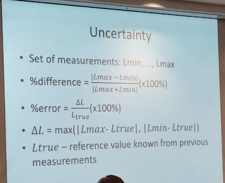

#Physics 1/13/15
- **Theories** sets of statements confirmed through experiments
- **Hypothesis** statements pending to prove
- **axioms** hypothesis assumed valid without proof
- **scientific law** statements that reflect general truth of nature
##Measurement
*Metric System*
- based off of powers of 10
*SI System* 
- length (meter)
- mass (kilogram)
- time (second)
- temperature
	 - electric current (ampere) amp
	 - luminous intensity (candela) cd
*CGS System*
- Centimeter
- Gram
- Second
*Most common units are gram, liter, meter, celsius*
*Most common prefixes are Kilo Centi Mili*
*Most common measurements kilogram, miligram, mililiter, centimeter, milimeter*
##Estimates
- Eratosthenes (240B.C.) - Measuring radius of Earth.
- Enrico Fermi - Calculations "on back of envelope"

