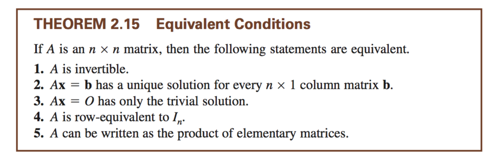

# CH 2.4

Theorem 2.12:

    multiplying a matrix by an elementary matrix applies the same elementary operation to that matrix.

The inverse of an elementary matrix is the matrix that turns it into an identity matrix.

When finding the inverse of a square matrix, the elementary matrices produced from the row operations are equaled to identity when added together.

**lower/upper triangular matrix**

Can solve `Ax=b`

    LUx = b
    y = Ux, Ly = b
