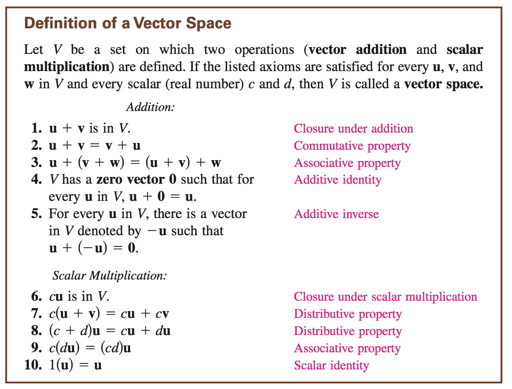

**4 entities**
1. set of vectors
2. set of scalars
3. addition
4. scalar multiplication

    V -> u,w,z

**addition**
1. they should all be inside V
2. `u + w = w + u`
3. `3 - u + (w + z) = (u + w) + z`
4. `u + 0 + 0 + u`
5. `5 - u + (-u) = 0`

**scalars**
1. `c * u` is in V
2. `c(u + w) = c * u + c * w`
3. `(c + d)u = c*u + d*u`
4. `c(d * u) = (c * d)u`

**test for a subspace**

1. if u and v are in W then `u + v` is in W
2. if u is in W and c is any scalar, c*u is in W

**condition for subspace**
1. nonempty
2. u,v in W -> u + v in W
3. c, u in W -> c*u in W

**subspace of R^2**
1. W is a single point (0,0)
2. W consists of all points in a line
3. W is all of R^2

*it needs to have 0*

**linear combination of vectors in a vector space**

*Vector space axioms*

