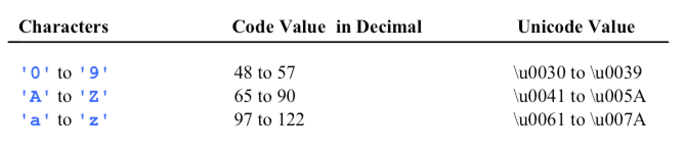
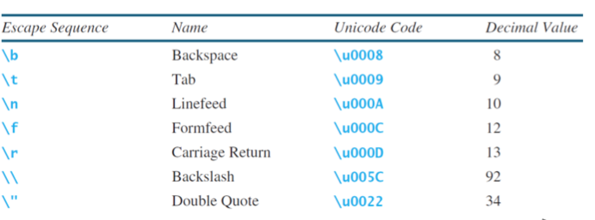

# CH4

**characters**

for characters, putting `\u` before it signifies its unicode.

    char letter = '\u0041';

you can increment chars

    letter++; //will move it to next character

`String` is a predefined class. However it is not a `primative type` it is instead known as a `reference type`.

**string methods**

- `length` `charAt(a)` `concat(a)` `toUpperCase` `toLowerCase` `trim`
  - these are called **instance methods** because they require an object
    - otherwise it is called an **static method** e.g `Math.PI()` is a static.
- It is also possible to compare strings! (>, <, =)
  - i dunno how it does it though.
- `indexOf(string, fromIndex)`
- `.substring(i,distance)`

**conversion**
- `Integer.parseInt(str)`

**misc**

The `scanner` object takes words separated by spaces.
- `.next()` iterates this

    System.out.printf("the number %d is %s", double, string);

### CH5

Basically... for loops lol.
