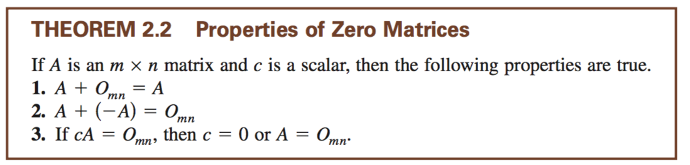

# Chapter 2.1

*covered how to multiply matrices*
- When you multiply a `axb` by a `cxd` the resulting matrix will be a `axd`

*basic algebraic operations*

*matrix identity*
- `I` denotes identity matrix.

    [1 0 0]
    [0 1 0]
    [0 0 1]

`Am*n` * `In*n` = `Am*n`

`Im*m` * `Am*n` = `Am*n`

*matrix transposition*
- flip the matrix about the diagonal.
  - `Am*n`^t = An*m

    (A^t)^t = A
    (A + B)^t = A^t + B^t
    (cA)^t = c(A^t)
    (AB)^t = B^t * A^t

**symmetric matrix** if and only if `A = A^t`

**skew-symmetric matrix** if and only if `A^t = -A`

*the expression `A * A^t` is symmetric*

*partitioning matrices*

    [a11 a12 ..][x1]
    [a21 a22 ..][x2] = b

    x1 * [a11 a12 ..] + x2 * [a11 a12 ..] = b
         [a21 a22 ..]        [a21 a22 ..]

*b needs to be the same size as x matrix*

# Chapter 2.2

*matrix addition/multiplication*

