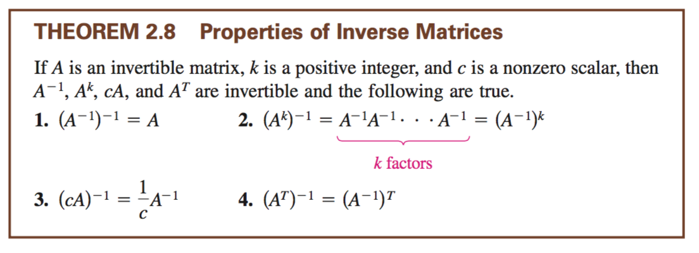

# Chapter 2.3

    A * A^-1 = I

**singular** means the matrix is not invertible

A^0 is equal to identity matrix

To find the **inverse**:
1. set up

    [1 2 3 | 1 0 0]
    [4 5 6 | 0 1 0]
    [7 8 9 | 0 0 1]

2. solve.

To find the inverse of `2x2`:
1. convert to other form

    [a b] = [d -b]
    [c d]   [-c a]

2. multiply by inverse of determinant

    A^-1 = 1/(ad-bc)* [d -b]
                      [-c a]

If the matrix `A` is `invertible` then
- `A^-1`,`A^k`, `c * A`, `A^t` are invertible. (where k is a positive int and c is a nonzero scalar)
- `Ax = b` is the same as `x = A^-1 * b`

    (AB)^-1 = B^-1 * A^-1

#chapter 2.4

elementary matrices can always be inverted, and the inverse is an elementary matrix.

A square matrix is invertible if and only if it is a product of two elementary matrices
