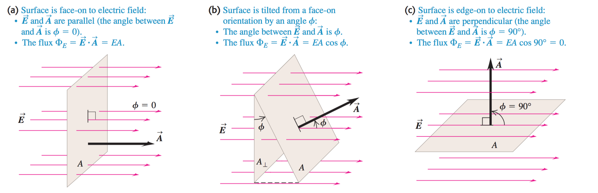
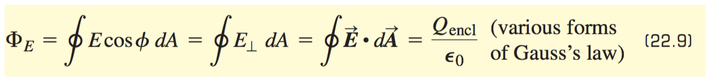

# CH 22 Gauss's Law

*Gauss's law* can be summarized as:

1. outward/inward flux depends on the sign of the net charge inside.
2. *if there is no net charge inside a surface, there is no net flux*
  - there can still be an electric field through object
  - these electric fields *do not* change net flux.
3. net electric *flux* is proportional to the net charge inside the surface but otherwise is independent of the surface.

The equation for flux in a uniform electric field:

    **Flux (phi)** = Energy * Area * cos(theta)

    Flux = ∫E * d * A * cos(theta) = +qnet/E0

This is equation from *gauss's law*. You can derive *coloumbs* law from this equation.
- the same concept applies to fluid dynamics
- instead of `E` it would be velocity of water.

In the case of a flat surface:

    Flux = E * A <- where both are vectors

- the force A is the normal to the surface

**general form of gauss's law**

*an electric field line that enters a surface containing no charge must exit it too*
