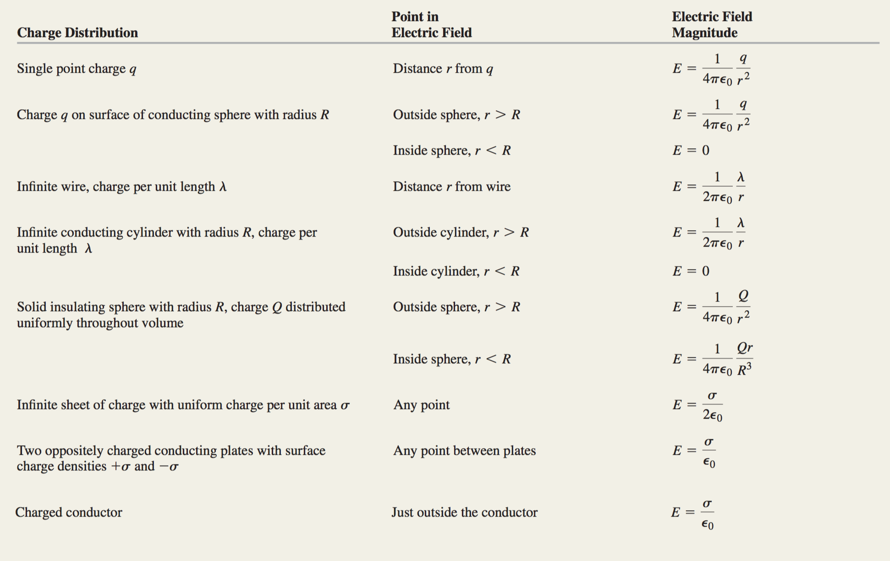
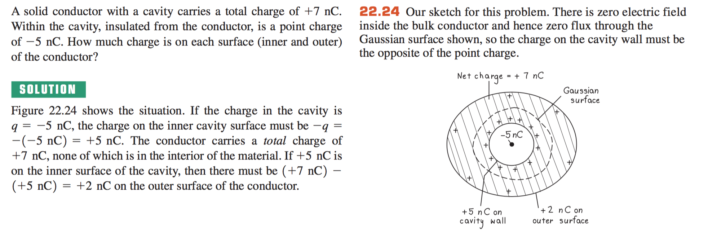

## exam 1
- short answer
- true/false (write statement for bonus points)
- show your work x1 30 points
  - partial credit
- multiple choice
  - no partial credit
- is closed book! Only formula sheet.
- bring scientific calculator
- over chapter 21-22 HW 1-5
- 6-7 questions
-

# CH 22 cont.

    E = lambda / (2 * pi * e0 * r) // long wire charge
    E = sigma / (2 * e0) // sheet charge
    E = sigma /  e0 // plate charge

- lambda = charge / length
- sigma = charge / area
- ro = charge / volume

When excess charge is placed on a solid conductor and is at rest, it stays on the surface of the material, not inside.
- excess means not electrons that compose the material.
- also the electric field inside the conductor is 0.
  - even if the sphere was hollow

    volume charge density = Q / V

assume *electrostatic equillibrium* electric field is 0 inside an objects. Then there are no charges inside, unless on the surface.
- this is why charges are perpendicular.

**cavity stuff**

If there is a positive charge in a cavity, there has to be a negative charge on surface of that cavity
- due to Gauss's law that there can be no net charge inside an uncharged surface.

# CH 23 Potential Energy

    change in potential energy (Uf - Ui) = -W
      = -q0 * E * d
    //work is done by the gravitational field.

    V = U/q0 (volts or J / C)

    Vf - Vi = -E * d
            = integral(Vf,Vi) -E * dr
